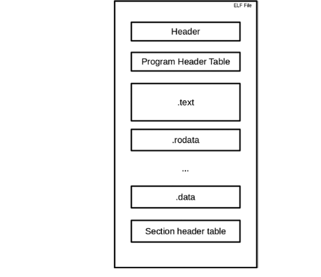
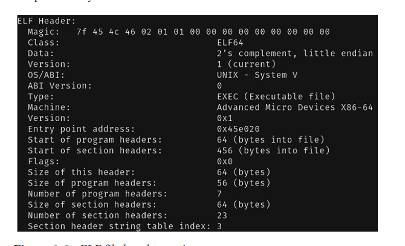
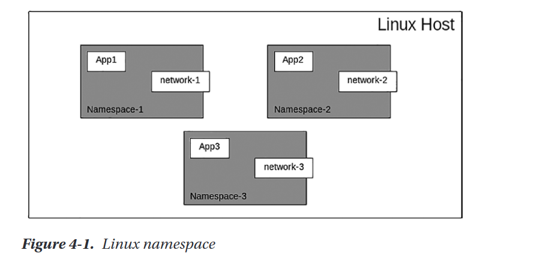

# ELF
ELF is a common standard file format for executable files, object code,
shared libraries, and core dumps;

ELF.GO This is a simple app that
dumps the contents of a Go ELF executable file. You will look at how the
application uses the Go library to read the ELF file.

launch ./ELF -action=dump -filename=./PATH_TO_EXECUTABLE

Once the file is open, it calls dump_symbols to dump the file contents.
The dump_symbols function dumps all symbols information from the file,
which is made available by calling the file.Symbols() function. 

# GO CONTAINER
Key elements.
• The Linux namespace
• Understanding cgroups and rootfs
• How containers use rootfs
## namespace
A namespace is a feature provided by the Linux kernel for applications
to use, so what actually is it? It is used to create an isolated environment for
processes that you want to run with their own resources.

## cgroups

cgroups stands for control groups, which is a feature provided by the
Linux kernel.cgroups gives users the ability to limit certain resources such as the CPU
and memory network allocated for a particular process or processes.
cgroups resides inside the /sys/fs/cgroup directory. 

## rootfs

rootfs stands for root
filesystem, which simply means it is the filesystem containing all the basic
necessary files required to boot the operating system. Without the correct
rootfs, the operating system will not boot up and no application can run.
rootfs is required so that the operating system can allow other file
systems to be mounted, which includes configuration, essential startup
processes and data, and other filesystems that are located in other disk
partitions.

To run an application inside a container requires rootfs, which allows
the application to run like how it runs in a normal system.Head over to www.
alpinelinux.org/downloads/ to download the Alpine rootfs

sudo ./gontainer --chrt "[rootfs directory]]" run sh

The command will run the sh command, which is the native
bash command for the Alpine distro in a container. Replace [rootfs
directory] with the directory containing the uncompressed Alpine roofs.